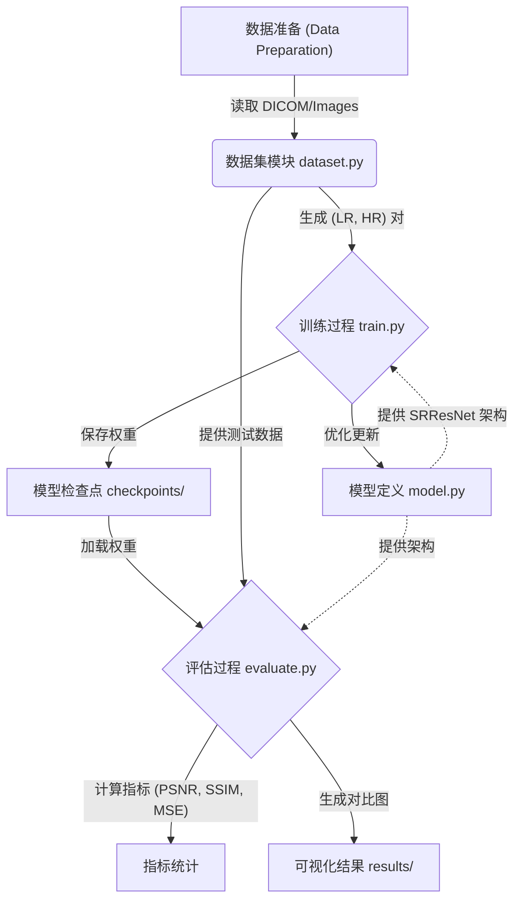
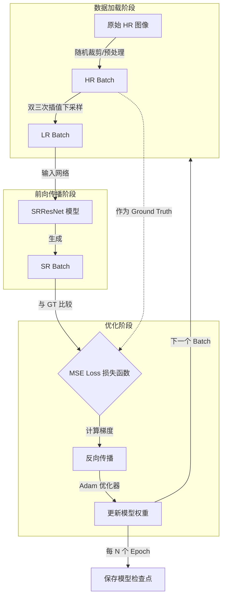

# CT 超分辨率增强框架 (CT Super-Resolution Framework)

这是一个基于 PyTorch 的简单 CT 图像超分辨率（Super-Resolution）框架，使用了残差网络架构（SRResNet）。

## 模块组成 (Module Composition)

以下展示了本项目的核心模块及其交互关系：



## 训练模块详解 (Training Module Breakdown)

训练过程 (`train.py`) 是整个框架的核心，负责协调数据加载、模型前向传播、误差计算和权重更新。

### 训练流程图 (Training Flowchart)



### 关键步骤说明

1. **数据加载 (Data Loading)**: `CTDataset` 类从磁盘读取 DICOM 或图像文件，进行随机裁剪以增加数据多样性，并实时生成低分辨率 (LR) 输入。
2. **前向传播 (Forward Pass)**: LR 图像输入到 `SRResNet`，网络通过残差块提取特征并进行上采样，输出重建的高分辨率图像 (SR)。
3. **损失计算 (Loss Calculation)**: 使用均方误差 (MSE) 衡量生成图像 (SR) 与真实图像 (HR) 之间的像素级差异。
4. **反向传播与优化 (Optimization)**: 根据损失值计算梯度，使用 Adam 优化器更新网络参数，逐步提升重建质量。

## 功能特性 (Features)

1. **高质量数据集模块**: 自动处理高分辨率 CT 图像，生成用于训练的 低分辨率(Low-Res) / 高分辨率(High-Res) 图像对。支持 **DICOM (.dcm)**, PNG, JPG 和 TIF 格式。
2. **训练策略**: 标准的 SRResNet 训练流程，使用 MSE 损失函数。支持自定义超参数。
3. **实验与评估**: 计算 PSNR, SSIM, MSE 和推理时间。生成视觉对比图和指标分布直方图。

## 数据获取 (Data Acquisition)

### 1. 自动下载样本

想要快速开始（使用 COVID-CT 切片样本），请运行：

```bash
python download_data.py
```

这将下载并解压图像到 `data/` 目录。

### 2. 外部专业数据集

如果需要进行完整训练，请考虑以下高质量的公共资源：

* **RPLHR-CT Dataset**: [Zenodo 下载](https://zenodo.org/records/17239183)。包含真实的 薄层/厚层 CT 配对数据。
* **CT-Super-Resolution**: [GitHub 仓库](https://github.com/labcisne/CT-Super-Resolution)。
* **The Cancer Imaging Archive (TCIA)**: 特别是 [LDCT-and-Projection-data](https://wiki.cancerimagingarchive.net/display/Public/LDCT-and-Projection-data) (Mayo Clinic)。
* **CT-ORG**: 包含多种器官分割的 140 个 CT 扫描。

**注意**: 本框架现已支持直接加载 `.dcm` (DICOM) 文件。只需将它们放入 `data/` 文件夹即可。

## 环境依赖 (Prerequisites)

安装依赖库：

```bash
pip install -r requirements.txt
```

## 项目结构 (Structure)

* `data/`: 放置你的高分辨率 CT 图像（PNG, JPG, TIF, DCM）。
* `model.py`: 定义 SRResNet 网络架构。
* `dataset.py`: 处理数据加载和合成下采样（Downsampling）。
* `train.py`: 模型训练脚本。
* `evaluate.py`: 模型评估与结果生成脚本。

## 使用方法 (Usage)

### 1. 数据准备

将你的训练图像放入 `data/` 目录。如果没有图像，训练脚本将生成合成的虚拟数据用于演示。

### 2. 训练 (Training)

运行训练脚本：

```bash
python train.py --epochs 10 --batch_size 4 --scale_factor 4
```

选项说明：

* `--data_dir`: 图像目录路径 (默认: `./data`)
* `--scale_factor`: 上采样倍率 (默认: 4)
* `--epochs`: 训练轮数 (默认: 10)

训练完成后，检查点将保存到 `checkpoints/` 目录，训练损失曲线保存为 `training_loss.png`。

### 3. 评估 (Evaluation)

运行评估脚本：

```bash
python evaluate.py --model_path checkpoints/model_final.pth --scale_factor 4
```

该脚本将执行以下操作：

* 计算 PSNR, SSIM, MSE 和推理时间。
* 将视觉对比结果（LR vs SR vs HR）保存到 `results/`。
* 将指标分布直方图保存到 `results/metrics_distribution.png`。

## 指标说明 (Notes on Metrics)

* **PSNR, SSIM, MSE**: 超分辨率属于回归任务，我们使用这些指标来衡量重建质量。
  * **PSNR (峰值信噪比)**: 数值越高越好。
  * **SSIM (结构相似性)**: 数值越接近 1 越好。
  * **MSE (均方误差)**: 数值越低越好。
* **AUC**: 曲线下面积通常用于分类任务，不适用于此处的图像重建任务。
