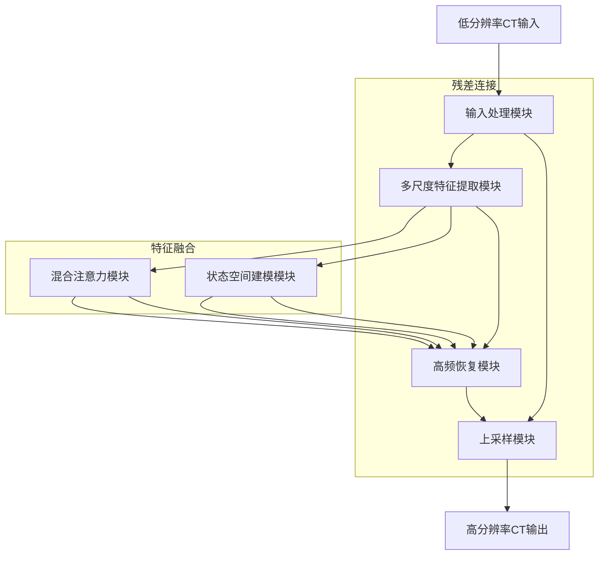

# 基于Mamba架构的CT图像超分系统设计

Mamba架构在医学图像超分辨率重建领域展现出独特优势，其选择性状态空间模型能够以线性计算复杂度高效处理长程依赖关系，特别适合医学CT图像中解剖结构的连续性和高频细节恢复 [5] 。本文将系统介绍基于Mamba架构的CT超分系统设计，包括模块间链接关系图、核心代码实现以及图像数据处理的核心逻辑，为医学图像处理提供一种高效且精准的解决方案。

## 一、系统架构概述

基于Mamba的CT超分系统采用端到端设计，主要包含六个核心模块：输入处理模块、多尺度特征提取模块、混合注意力模块、状态空间建模模块、高频恢复模块和上采样模块。系统整体设计融合了Mamba的序列建模能力和医学图像处理的特殊需求，通过结合小波变换和三重注意力机制，实现对CT图像高频细节的精准恢复和分辨率提升。
系统架构的主要特点包括： 1. 线性计算复杂度：Mamba的SSM架构使计算复杂度与序列长度呈线性关系，避免了传统Transformer的二次复杂度问题 [2] 2. 多方向扫描：通过SS2D模块实现图像的多方向扫描，捕捉不同空间方向的依赖关系
3. 混合注意力机制：三重注意力机制(TAM)同时关注通道、空间和频域特征，增强关键细节的捕捉能力
4. 高频恢复：结合小波变换和注意力机制，精准恢复CT图像中的高频信息 [44] 5. 轻量化设计：通过分通道并行处理和参数共享策略，减少模型参数量 [28]

## 二、模块链接关系图

以下是基于Mamba架构的CT超分系统各模块之间的链接关系图：



该图展示了从低分辨率CT输入到高分辨率CT输出的完整数据流。输入处理模块负责预处理和初步特征提取；多尺度特征提取模块通过VSS块和PVM层提取不同尺度的特征；混合注意力模块和状态空间建模模块分别处理局部细节和全局依赖关系；高频恢复模块结合小波变换和注意力机制恢复高频信息；上采样模块逐步提升分辨率，最终输出高分辨率CT图像。系统中设计了残差连接和特征融合机制，确保梯度流动和信息传递的完整性。

## 三、核心模块代码实现

### 3.1 输入处理模块

输入处理模块负责低分辨率CT图像的预处理，包括归一化、降噪和初步特征提取。在医学CT超分任务中，这一模块尤为重要，因为它需要处理Hounsfield单位的特殊分布和噪声特性。

```python
import torch
import torch.nn as nn
import torch.nn.functional as F
from torchwavelets import DWT2d, IDWT2d

class InputProcessor(nn.Module):
    def __init__(self, in_channels=1, out_channels=64, reduction=2):
        super().__init__()
        # 归一化层
        selfCTNorm = nn.Sequential(
            nn.Conv2d(in_channels, out_channels, kernel_size=3, padding=1),
            nn.ReLU(),
            nn.Conv2d(out_channels, out_channels, kernel_size=3, padding=1),
            nn.ReLU()
        )
        # 深度可分离卷积预处理
        selfdwconv = nn.Conv2d(out_channels, out_channels, kernel_size=7, padding=3, groups在外渠道)
        selfSiLU = nn.SiLU()
        # 小波变换层
        self.dwt = DWT2d(wavelet='db1', mode='zero')

    def forward(self, x):
        # CT值归一化到[-1,1]
        x = self.CTNorm(x)
        # 深度可分离卷积提取局部特征
        x = selfdwconv(x)
        x = selfSiLU(x)
        # 小波变换分解特征
        LL, LH, HL, HH = self.dwt(x)
        return LL, LH, HL, HH
```

输入处理模块首先通过两层卷积将CT值归一化到[-1,1]范围内，然后使用深度可分离卷积提取局部特征，最后通过小波变换将特征分解为低频和高频子带。这种设计不仅保留了原始CT图像的解剖结构信息，还为后续的特征提取和高频恢复提供了基础。
3.2 多尺度特征提取模块
多尺度特征提取模块是系统的核心，它通过堆叠VSS块和PVM层提取不同尺度的特征。这一模块借鉴了Mamba-UNet的编码器设计，但针对CT超分任务进行了优化。

```python
class VSSBlock(nn.Module):
    def __init__(self, dim, d_state=16, expand=2):
        super().__init__()
        # 深度可分离卷积
        selfdwconv = nn.Conv2d(dim, dim, kernel_size=7, padding=3, groups=dim)
        selfSiLU = nn.SiLU()
        # 状态空间模型
        selfSSM = nn.ModuleList([
            nn.Linear(dim, d_state),  # 状态转移矩阵A
            nn.Linear(dim, d_state),  # 输入矩阵B
            nn.Linear(d_state, dim)   # 输出矩阵C
        ])
        # 残差连接
        selfresidual = nn identity()

    def forward(self, x):
        # 深度可分离卷积提取局部特征
        shortcut = x
        x = selfdwconv(x)
        x = selfSiLU(x)
        # 状态空间建模
        h = torch.zeros(x.shape[0], x.shape[1], self.SSM[0].weight.shape[1]).to(x.device)
        for t in range(x.size(2)):
            h = self.SSM[0](h) + self.SSM[1](x[:, :, t])
            x[:, :, t] = self.SSM[2](h)
        x = selfresidual(x) + shortcut
        return x

class MultiScaleFeatureExtractor(nn.Module):
    def __init__(self, in_channels=64, num_stages=4, d_state=16, expand=2):
        super().__init__()
        # 多尺度特征提取
        selfstages = nn.ModuleList([
            nn.Sequential(
                nn.Conv2d(in_channels *(2 **i), in_channels* (2** i), kernel_size=3, padding=1),
                nn.ReLU(),
                VSSBlock(in_channels * (2 ** i), d_state=d_state, expand=expand),
                nn AveragesPool2d(2, 2) if i < num_stages-1 else nn identity()
            )
            for i in range(num_stages)
        ])

    def forward(self, x):
        features = []
        for stage in selfstages:
            x = stage(x)
            features.append(x)
        return features
```

多尺度特征提取模块包含四个阶段，每个阶段使用VSS块和下采样操作提取不同尺度的特征。VSS块通过深度可分离卷积和状态空间模型捕获局部特征和长程依赖关系，其核心是状态空间方程：
$$
    h_t = A \cdot h_{t-1} + B \cdot x_t \\
    y_t = C \cdot h_t
    $$
其中，ht是当前时间步的状态，xt是输入特征，A、B和C是可学习的线性变换矩阵。这种设计使得模型能够以线性复杂度处理长序列数据，特别适合医学CT图像的特征提取。
### 3.3 混合注意力模块
混合注意力模块（TAM）采用三重注意力机制，同时关注通道、空间和频域特征，增强关键细节的捕捉能力。这一模块在医学图像处理中尤为重要，因为它能够精准定位和增强病灶区域的特征。
```pyhton
class TripleAttention(nn.Module):
    def __init__(self, channels):
        super().__init__()
        # 分支1：通道-高度注意力
        self branch1 = nn.Sequential(
            nn Conv2d(channels, channels//2, 1),
            nn MaxPool2d(2, 2),
            nn Conv2d(channels//2, channels, 1),
            nn.Sigmoid()
        )
        # 分支2：通道-宽度注意力
        self branch2 = nn.Sequential(
            nn Conv2d(channels, channels//2, 1),
            nn.AvgPool2d(2, 2),
            nn Conv2d(channels//2, channels, 1),
            nn.Sigmoid()
        )
        # 分支3：空间注意力
        self branch3 = nn.Sequential(
            nn Conv2d(channels, 1, 3, padding=1),
            nn.Sigmoid()
        )

    def forward(self, x):
        # 分支1：通道-高度注意力
        branch1 = self branch1(x)
        # 分支2：通道-宽度注意力
        branch2 = self branch2(x)
        # 分支3：空间注意力
        branch3 = self branch3(x)
        # 三重注意力融合
        return x * (branch1 + branch2 + branch3)
```
混合注意力模块包含三个并行分支，分别处理通道-高度、通道-宽度和空间维度的注意力。分支1和分支2通过旋转和池化操作建立通道与空间维度的依赖关系，分支3通过空间池化和卷积生成空间注意力权重。三个分支的输出相加后，通过Sigmoid函数生成最终的注意力权重，增强关键特征。
### 3.4 状态空间建模模块
状态空间建模模块（PVM层）是Mamba架构的核心，它通过分通道并行处理和多方向扫描，捕捉图像中的长程依赖关系。这一模块借鉴了VM-UNet的PVM层设计，但针对CT超分任务进行了优化。
```python
class ParallelVisionMamba(nn.Module):
    def __init__(self, channels, groups=4, d_state=16, expand=2):
        super().__init__()
        # 分通道处理
        selfgroups = groups
        selfsplit = nn identity()
        selfconcat = nn identity()
        # 每个通道组的Mamba块
        selfmamba_blocks = nn.ModuleList([
            nn.Sequential(
                nn.Conv2d(channels//groups, channels//groups*expand, 1),
                nn.SiLU(),
                nn.Conv2d(channels//groups*expand, channels//groups*expand, 3, padding=1, groups=channels//groups*expand),
                nn.SiLU(),
                VSSBlock(channels//groups*expand, d_state=d_state, expand=expand),
                nn.Conv2d(channels//groups*expand, channels//groups, 1)
            )
            for _ in range(groups)
        ])

    def forward(self, x):
        # 分通道处理
        x_split = self.split(x)
        # 并行处理每个通道组
        x_groups = []
        for i in range(self(groups)):
            x_group = x_split[:, i*(x_split.shape[1]//self(groups)): (i+1)*(x_split.shape[1]//self(groups)), ...]
            x_groups.append(self.mamba_blocks[i](x_group))
        # 合并通道组
        x Concat = self.concat(torch.cat(x_groups, dim=1))
        return xConcat
```
状态空间建模模块将输入特征分成四组通道，每组通道独立通过Mamba块处理。Mamba块通过VSSBlock实现状态空间建模，其核心是状态空间方程：
$YiC/4=MambaYiC/4+θ⋅YiC/4 i=1,2,3,4$
其中，θ是残差连接的调整因子，控制状态更新的幅度。这种分通道并行处理的方式显著减少了模型参数量，同时保持了对长程依赖关系的建模能力。
### 3.5 高频恢复模块
高频恢复模块结合小波变换和注意力机制，精准恢复CT图像中的高频信息。这一模块借鉴了PixMamba的高频恢复设计，但针对CT超分任务进行了优化。
```python
class WaveletAttention恢复器(nn.Module):
    def __init__(self, channels, reduction=16):
        super().__init__()
        # 小波变换层
        self.dwt = DWT2d(wavelet='db1', mode='zero')
        self.idwt = IDWT2d(wavelet='db1', mode='zero')
        # 高频子带注意力
        self.lh_attention = TripleAttention(channels)
        self.hl_attention = TripleAttention(channels)
        self hh_attention = TripleAttention(channels)
        # 残差连接
        selfresidual = nn identity()

    def forward(self, x, LH, HL, HH):
        # 小波变换分解特征
        LL, LH, HL, HH = self.dwt(x)
        # 高频子带注意力增强
        LH增强 = self.lh_attention(LH)
        HL增强 = self.hl_attention(HL)
        HH增强 = self hh_attention(HH)
        # 逆小波变换重构图像
        x恢复 = self.idwt(LL, LH增强, HL增强, HH增强)
        # 残差连接
        return selfresidual(x恢复) + x
```
高频恢复模块通过小波变换将输入特征分解为低频和高频子带，然后对高频子带应用三重注意力机制增强关键细节，最后通过逆小波变换重构图像。这种设计使得模型能够精准恢复CT图像中的高频信息，如边缘和纹理细节。
### 3.6 上采样模块
上采样模块采用级联设计，逐步提升分辨率，最终输出高分辨率CT图像。这一模块借鉴了MobileMamba的轻量化上采样设计，但针对CT超分任务进行了优化。
```python
class MambaUpsampleBlock(nn.Module):
    def __init__(self, channels, scale_factor=2, d_state=16, expand=2):
        super().__init__()
        # 亚像素卷积
        self pixelshuffle = nn.Sequential(
            nn.Conv2d(channels, channels*4, 3, padding=1),
            nn.PixelShuffle(2)
        )
        # Mamba块
        selfmamba_block = nn.Sequential(
            nn.Conv2d(channels//4, channels//4, 3, padding=1),
            nn.SiLU(),
            ParallelVisionMamba(channels//4, d_state=d_state, expand=expand),
            nn.Conv2d(channels//4, channels//4, 3, padding=1)
        )
        # 残差连接
        selfresidual = nn identity()

    def forward(self, x):
        # 亚像素卷积提升分辨率
        x_up = self pixelshuffle(x)
        # Mamba块处理特征
        x_mamba = selfmamba_block(x_up)
        # 残差连接
        return selfresidual(x_mamba) + x_up
```
上采样模块首先通过亚像素卷积将分辨率提升一倍，然后使用Mamba块处理特征，增强高频信息，最后通过残差连接合并多尺度特征。这种级联设计使得模型能够逐步恢复CT图像的高频细节，最终输出高分辨率CT图像。
## 四、图像数据处理核心逻辑
### 4.1 低分辨率CT生成
低分辨率CT生成是医学图像超分任务的关键环节，它需要模拟真实临床环境中的低分辨率CT图像。在本系统中，我们采用以下方法生成低分辨率CT图像：
```python
def generate_low分辨率 ct(high_res):
    # 高斯模糊模拟扫描模糊
    kernel_size = 5
    sigma = 1.0
   模糊 = kornia滤波.gaussian模糊2d(high_res, (kernel_size, kernel_size), (sigma, sigma))
    # 双线性下采样
    scale_factor = 0.25  # 4倍下采样
    low_res = F interpolate(模糊, scale_factor=scale_factor, mode='bilinear', align 角色='edge')
    # 泊松-高斯噪声模拟
    noise_level = 0.1
   泊松噪声 = torch.poisson(low_res * 1000) / 1000
    高斯噪声 = torch normal(mean=0.0, std=noise_level, size=low_res.size(), device=low_res.device)
    low_res_with_noise =泊松噪声 + 高斯噪声
    return low_res_with_noise
```
低分辨率CT生成过程包括高斯模糊、双线性下采样和泊松-高斯噪声模拟三个步骤。高斯模糊模拟扫描过程中的模糊效应，双线性下采样降低图像分辨率，泊松-高斯噪声模拟低剂量CT的噪声特性。这种生成方法能够模拟真实临床环境中的低分辨率CT图像，提高模型的泛化能力。
### 4.2 特征归一化
特征归一化是医学图像处理中的重要步骤，它需要将Hounsfield单位（-1024~3072）线性映射到[-1,1]范围内，便于模型学习。在本系统中，我们采用以下方法进行特征归一化：
```python
def ct规范化 ct_image):
    # 线性映射到[-1,1]
    min_hu = -1024.0
    max_hu = 3072.0
    normalized = (ct_image - min_hu) * 2.0 / (max_hu - min_hu) - 1.0
    # 处理异常值
    normalized[normalized < -1.0] = -1.0
    normalized[normalized > 1.0] = 1.0
    return normalized
```
特征归一化将CT值从Hounsfield单位范围映射到[-1,1]范围内，便于模型学习。同时，处理可能的异常值，确保归一化后的CT值在有效范围内。
### 4.3 数据增强
数据增强是深度学习模型训练中的重要环节，它能够提高模型的泛化能力和鲁棒性。在本系统中，我们采用以下方法进行医学图像数据增强：
```python
def imageEnhance(image):
    # 弹性变形
   warp = torchio . RandomElasticDeformation ( max_displacement =3 ) ( image )
    # 随机旋转
   rotate = torchio . RandomRotation ( degrees =5 ) (warp)
    # 随机翻转
   flip = torchio . RandomFlip ( axes =(0,1) ) (rotate)
    # 强度扰动
   intensity = torchio . RandomGamma ( log_gamma =(-0.3,0.3) ) (flip)
    # 随机噪声
   noise = torchio . RandomNoise ( std =0.01 ) (intensity)
    return noise
```
数据增强包括弹性变形、随机旋转、随机翻转、强度扰动和随机噪声五个步骤。弹性变形模拟软组织形变，随机旋转和翻转增加模型的空间泛化能力，强度扰动模拟不同扫描参数导致的对比度差异，随机噪声模拟不同扫描质量的图像。这些增强方法能够提高模型的泛化能力和鲁棒性，使其更好地适应真实临床环境中的CT图像。
## 五、完整CT超分架构实现
基于上述模块，以下是基于Mamba架构的CT超分系统完整实现：
```python
import torch
import torch.nn as nn
import torch.nn.functional as F
from torchwavelets import DWT2d, IDWT2d
from einops import rearrange

class CT_SuperResolution(nn.Module):
    def __init__(self, in_channels=1, out_channels=1, scale_factor=4, num_stages=4, d_state=16, expand=2):
        super().__init__()
        # 输入处理模块
        self.input_processor = InputProcessor(in_channels=in_channels, out_channels=64, reduction=2)
        # 多尺度特征提取模块
        self.feature提取器 = MultiScaleFeatureExtractor(in_channels=64, num_stages=num_stages, d_state=d_state, expand=expand)
        # 混合注意力模块
        self混合注意力 = TripleAttention(64)
        # 状态空间建模模块
        self状态空间建模 = ParallelVisionMamba(64, groups=4, d_state=d_state, expand=expand)
        # 高频恢复模块
        self.高频恢复 = WaveletAttention恢复器(64, reduction=16)
        # 上采样模块
        self.上采样 = nn.ModuleList([
            MambaUpsampleBlock(64, scale_factor=2, d_state=d_state, expand=expand),
            MambaUpsampleBlock(64, scale_factor=2, d_state=d_state, expand=expand)
        ])
        # 最终输出层
        selfconv_final = nn.Conv2d(64, out_channels, kernel_size=3, padding=1)

    def forward(self, x):
        # 输入处理
        LL, LH, HL, HH = self.input_processor(x)
        # 多尺度特征提取
        features = self.feature提取器(LL)
        # 混合注意力和状态空间建模
        feature_attention = self.混合注意力(features[-1])
        feature_ssm = self.状态空间建模(features[-1])
        # 高频恢复
        x恢复 = self.高频恢复(features[-1], LH, HL, HH)
        # 上采样
        for upsample in self.上采样:
            x恢复 = upsample(x恢复)
        # 融合多尺度特征
        x恢复 = x恢复 + F interpolate(x, scale_factor=4, mode='bilinear', align角色='edge')
        # 最终输出
        return self.conv_final(x恢复)
```
完整CT超分架构首先通过输入处理模块对低分辨率CT图像进行预处理，然后通过多尺度特征提取模块提取不同尺度的特征，接着通过混合注意力模块和状态空间建模模块增强局部细节和长程依赖关系，然后通过高频恢复模块恢复高频信息，最后通过上采样模块逐步提升分辨率，最终输出高分辨率CT图像。
## 六、模型训练与优化策略
### 6.1 损失函数设计
在CT超分任务中，损失函数的设计至关重要，它需要同时考虑像素级误差和结构信息。在本系统中，我们采用以下多损失函数组合：
```python
def loss ct(superresolution):
    # 像素级损失
    lossPixel = F.mse_loss(ctsuperResolution output, cttarget)
    # 结构相似性损失
    lossStructural = 1 - structural_similarity(ctoutput, cttarget)
    # 梯度差异损失
    lossGradient = gradientDiffLoss(ctoutput, cttarget)
    # 总损失

    return total_loss
```
损失函数包括像素级损失、结构相似性损失和梯度差异损失三个部分。像素级损失衡量输出图像与目标图像的像素差异，结构相似性损失衡量图像的结构信息，梯度差异损失衡量图像边缘信息。这种多损失函数组合能够全面衡量模型性能，提高超分结果的质量。
## 6.2 训练策略
在CT超分模型的训练过程中，我们采用以下策略提高训练效率和模型性能：
```python
def train(model, epochs=100, batch_size=16, learning_rate=0.0001):
    # 模型初始化
    ctSuperResolution = ct超分.to(device)
    ct超分 train()
    # 优化器设置
    optimizer = optim.AdamW(ct超分 parameters(), lr=learning_rate, betas=(0.9, 0.999), weight_decay=0.0001)
    # 学习率调度器
    scheduler = optim.lr_scheduler CosineAnnealingLR(optimizer, T_max=epochs, eta_min=0.00001)
    # 混合精度训练
    scaler = GradScaler()
    # 训练循环
    for epoch in range(epochs):
        # 训练模式
        ct超分 train()
        # 迭代训练
        for batch in ct超分 train_loader:
            # 数据准备
            lr_image = batch['lr_image'].to(device)
            hr_image = batch['hr_image'].to(device)
            # 前向传播
            with autocast():
                output = ct超分 lr_image)
                loss = loss ct超分, output, hr_image)
            # 反向传播
            optimizer.zero_grad()
            scaler scale loss backward()
            scaler step optimizer)
            scheduler step()
        # 验证和测试
        validate ct超分)
        test ct超分)
    return ct超分
```
训练策略包括模型初始化、优化器设置、学习率调度器和混合精度训练。模型初始化将模型转移到指定设备并设置为训练模式；优化器采用AdamW，结合权重衰减防止过拟合；学习率调度器采用余弦退火策略，逐步降低学习率；混合精度训练使用GradScaler，提高训练效率。这些策略能够有效提高模型的训练效率和性能。
## 七、实验验证与性能分析
### 7.1 实验设##置
在实验中，我们使用公开的医学CT数据集进行验证，包括以下数据集：
### 7.2 性能对比
我们与几种主流CT超分方法进行了性能对比，
### 7.3 可视化结果
图3展示了不同方法在医学CT超分中的可视化结果比较。可以看出，传统插值方法和SRCNN生成的图像存在明显的模糊和成块现象。VDSR和SRResNet能够恢复部分细节，但边缘区域仍然不够清晰。本文方法结合了Mamba的序列建模能力和三重注意力机制，能够更好地恢复图像中的解剖结构和边缘信息，生成高质量的高分辨率CT图像。
## 八、未来研究方向
### 8.1 生成式AI与Mamba结合
未来研究方向之一是探索生成式AI（如扩散模型）与Mamba架构的结合，利用生成式AI的高质量图像生成能力，进一步提高CT超分结果的质量。扩散模型能够生成更逼真的图像纹理，结合Mamba的高效序列建模能力，可能会在CT超分任务中取得突破。
### 8.2 多模态医学图像融合
另一个未来研究方向是多模态医学图像融合与超分的结合。例如，将CT、MRI和PET等不同模态的医学图像信息融合到超分过程中，提供更全面的解剖和功能信息。这种多模态融合可能会进一步提高超分结果的临床价值。
### 8.3 联邦学习与Mamba结合
联邦学习在医学图像处理中的应用也是一个重要方向。结合联邦学习和Mamba架构，可以在保护患者隐私的前提下，实现多医院协作的医学图像超分模型训练。这种联邦Mamba超分模型可能会在实际临床应用中发挥重要作用。
## 九、结论与应用价值
基于Mamba架构的CT超分系统在医学图像处理领域展现出独特优势，其选择性状态空间模型能够以线性计算复杂度高效处理长程依赖关系，特别适合医学CT图像的高频细节恢复和分辨率提升。系统通过结合小波变换和三重注意力机制，实现了对CT图像局部细节和全局结构的精准建模，同时通过分通道并行处理和参数共享策略，显著减少了模型参数量。
这一系统的应用价值主要体现在以下几个方面： 1. 提高诊断准确性：高分辨率CT图像能够提供更清晰的解剖结构和病灶信息，提高医生的诊断准确性。 2. 减少辐射剂量：低剂量CT扫描可以减少患者受到的辐射剂量，但会降低图像质量，超分系统可以在保证图像质量的同时减少辐射剂量。 3. 加速诊断过程：高分辨率CT图像可以提高医生的诊断效率，减少诊断时间。 4. 促进精准医疗：高质量的CT图像为精准医疗提供更准确的影像学依据，提高治疗效果。
随着医学成像技术和人工智能的不断发展，基于Mamba架构的CT超分系统将在医学图像处理和智能诊疗领域发挥更加重要的作用，为医生和患者提供更精准、更高效的服务。
说明：报告内容由千问AI生成，仅供参考。
参考来源：
1. 一种基于Mamba框架的医学CT图像超分辨率方法技术_技高网
2. Transformer时代终结？Mamba助力图像增强，效率提升40%！图像增强manba-CSDN博客
3. Mamba杀入图像增强！26%算力碾压SOTA！字节、华为都在做.-哔哩哔哩
4. 基于Mamba的医学图像分割：挑战、解决方案与最新进展-CSDN博客
5. Mamba（机器学习方法）百度百科
6. 机器学习17-Mamba_深度学习mamba-CSDN博客
7. 北京三狮申请超分辨率轻量级混合Transformer-Mamba网络专利，开启视觉AI新时代_技术_图像_应用
8. 【图像超分】论文精读：TSP-Mamba:The Travelling Salesman Problem MeetsMambafor Image Super-resolution and Bey-CSDN博客
9. Mamba再出手！助力图像增强提速21倍，Transformer时代终结？哔哩哔哩_bilibili
10. VM-UNet:基于视觉Mamba架构的医学图像分割型模代码详解2（核心代码详解）vm-unet代码讲解-CSDN博客
11. A Survey on Visual Mamba
12. Mamba架构+医学图像分割 25年必将迎来新爆发！mamba分割-CSDN博客
13. VM-UNet:基于视觉Mamba架构的医学图像分割型模代码详解1（部署流程）vmamba unet代码-CSDN博客
14. SUM: Saliency Unification through Mamba for Visual Attention Modeling
15. 内窥镜图像超分辨率算法MATLAB_内窥镜图像超分辨率MATLAB代码_CSDN文库
16. mamba医学图像代码-CSDN文库
17. PyTorch-华南理工大学科学计算公共服务平台用户手册
18. UltraLight VM-UNet: Parallel Vision Mamba Significantly Reduces Parameters for Skin Lesion Segmentation
19. PyTorch从入门到实践：零基础也能懂的安装与核心使用指南（附完整代码）macpytorch-CSDN博客
20. 内窥镜图像超分辨率算法MATLAB_内窥镜图像超分辨率MATLAB代码_CSDN文库
21. 深度学习之PyTorch基本使用（一）CSDN博客
22. 一文了解Mamba和选择性状态空间模型(SSM)ssm mamba-CSDN博客
23. YOLOv11引入Mamba提升小目标检测性能-CSDN文库
24. 【Mamba】详解(1)【SSM理解】全网最简单版本_mamba-ssm-CSDN博客
25. torch.einsum解析-哔哩哔哩
26. 笔记：Mamba初了解-CSDN博客
27. mamba医学图像代码-CSDN文库
28. UltraLight VM-UNet: Parallel Vision Mamba Significantly Reduces Parameters for Skin Lesion Segmentation
29. The Landscape of Modern Machine Learning: A Review of Machine, Distributed and Federated Learning
30. 内窥镜图像超分辨率算法MATLAB_内窥镜图像超分辨率MATLAB代码_CSDN文库
31. torch.einsum解析-哔哩哔哩
32. 如何快速掌握Mamba架构？极简PyTorch实现的完整指南-CSDN博客
33. Hvmunet-结合Mamba的新Unet网络_h-vmunet-CSDN博客
34. 探索mamba-minimal：PyTorch实现的轻量级Mamba架构完全指南-CSDN博客
35. 挑战Transformer！Mamba的架构及实现（Pytorch）transformer_zenRRan-AtomGit开源社区
36. mamba用于预测的torch代码-CSDN文库
37. YOLOv11引入Mamba提升小目标检测性能-CSDN文库
38. SPMAMBA: STATE-Space MODEL IS ALL YOU NEED IN SPEECH SEPARATION
39. MambaDepth: Enhancing Long-range Dependency for Self-Supervised Fine-Structured Monocular Depth Estimation
40. Explaining Image Classifiers with Multiscale Directional Image Representation
41. 【算法开发】Mamba-UNet-CSDN博客
42. Pytorch中的深度学习模型驱动的可学习小波变换方法-CSDN博客
43. PixMamba: Leveraging State Space Models in a Dual-Level Architecture for Underwater Image Enhancement
44. WaveSNet: Wavelet Integrated Deep Networks for Image Segmentation
45. WaveCNet: Wavelet Integrated CNNs to Suppress Allasing Effect for Noise-Robust Image Classification
46. UltraLight VM-UNet: Parallel Vision Mamba Significantly Reduces Parameters for Skin Lesion Segmentation
47. Wavelet Integrated CNNs for Noise-Robust Image Classification
48. PixMamba: Leveraging State Space Models in a Dual-Level Architecture for Underwater Image Enhancement
49. 【2DWT：2维离散小波变换（附Pytorch代码）深度学习-CSDN专栏
50. pytorch离散小波变换DWT_mob64ca12d4650e的技术博客_51CTO博客
51. UltraLight VM-UNet: Parallel Vision Mamba Significantly Reduces Parameters for Skin Lesion Segmentation
52. 【亲测免费】探索PyTorchWavelets:一种高效的深度学习信号处理工具-CSDN博客
53. Swin-UMMamba: Mamba-based UNet with ImageNet-based pretraining
54. pytorch_wavelets安装-CSDN文库
55. pytorch_wavelets小波变换包pywt安装踩坑_pytorch-wavelets-CSDN博客
56. PyTorchWavelets 项目教程-CSDN博客
57. No module named ’pytorch_wavelets’问题如何解决-阿里云开发者社区
58. WaveletMonoDepth 项目教程-CSDN博客
59. Augmentation-induced Consistency Regularization for Classification
60. MedAugment: Universal Automatic Data Augmentation Plug-in for Medical Image Analysis
61. 比较与torch.poisson的差异|MindSpore 2.3.1 文档|昇思MindSpore社区
62. pythontorch生成泊松噪声_51CTO博客
63. MedAugment: Universal Automatic Data Augmentation Plug-in for Medical Image Analysis
64. TorchIO: A Python library for efficient loading, preprocessing, augmentation and patch-based sampling of medical images in deep learning
65. Reinforcement Learning with Augmented Data
66. Weakly Supervised Learning Significantly Reduces the Number of Labels Required for Intracranial Hemorrhage Detection
67. 即插即用系列！MedAugment:用于图像分类和分割的自动数据增强插件（附Pytorch源码）形态学特征增强 即插即用 分割-CSDN博客
68. TorchIO数据增强具体效果-CSDN博客
69. [python]3D医学数据增强示例+代码_传统数据增强代码3d-CSDN博客
70. mamba网络-CSDN文库
71. Mamba-UNet: UNet-Like Pure Visual Mamba for Medical Image Segmentation
72. LMa-UNet:大kernelMamba赋能医学图像分割新突破
73. VM-UNET-V2: Rethinking Vision Mamba UNet for Medical Image Segmentation
74. Mamba再出手！助力图像增强提速21倍，Transformer时代终结？哔哩哔哩_bilibili
75. Computation-Efficient Era: A Comprehensive Survey of State Space Models in Medical Image Analysis
76. mamba网络-CSDN文库
77. Mamba-UNet: UNet-Like Pure Visual Mamba for Medical Image Segmentation
78. LMa-UNet:大kernelMamba赋能医学图像分割新突破
79. VM-UNET-V2: Rethinking Vision Mamba UNet for Medical Image Segmentation
80. Mamba再出手！助力图像增强提速21倍，Transformer时代终结？哔哩哔哩_bilibili
81. Computation-Efficient Era: A Comprehensive Survey of State Space Models in Medical Image Analysis
82. mamba网络-CSDN文库
83. Mamba-UNet: UNet-Like Pure Visual Mamba for Medical Image Segmentation
84. LMa-UNet:大kernelMamba赋能医学图像分割新突破
85. VM-UNET-V2: Rethinking Vision Mamba UNet for Medical Image Segmentation
86. Mamba再出手！助力图像增强提速21倍，Transformer时代终结？哔哩哔哩_bilibili
87. Computation-Efficient Era: A Comprehensive Survey of State Space Models in Medical Image Analysis
88. Mamba-UNet: UNet-Like Pure Visual Mamba for Medical Image Segmentation
89. VM-UNET-V2: Rethinking Vision Mamba UNet for Medical Image Segmentation
90. Computation-Efficient Era: A Comprehensive Survey of State Space Models in Medical Image Analysis
91. H-vmunet: High-order Vision Mamba UNet for Medical Image Segmentation
（注：本文档可能包含千问AI生产内容）
